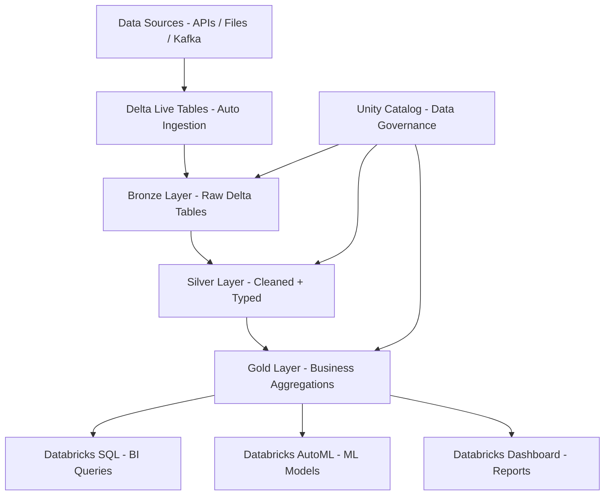

# Databricks Lakehouse — Delta Lake + Unity Catalog


Full lakehouse implementation on Databricks Community Edition using Delta Lake medallion architecture (Bronze → Silver → Gold), Unity Catalog for data governance, Delta Live Tables for streaming ingestion, and Databricks AutoML for rapid ML model development.

## Architecture



## Notebooks

| Notebook | Layer | Description |
|----------|-------|-------------|
| `01_bronze_ingestion.py` | Bronze | Raw data ingestion with schema inference |
| `02_silver_cleaning.py` | Silver | Deduplication, type casting, null handling |
| `03_gold_aggregations.py` | Gold | Business KPIs and dimensional aggregations |
| `04_delta_live_tables.py` | All | Streaming DLT pipeline definition |
| `05_automl_forecast.py` | ML | Demand forecasting with AutoML |

## Features

- Delta Lake ACID transactions with time travel (30-day history)
- Delta Live Tables for declarative streaming pipelines
- Unity Catalog for column-level data governance
- Z-ordering and OPTIMIZE for query acceleration
- Change Data Feed (CDF) for incremental processing
- Databricks AutoML integration for rapid prototyping
- Works on **Databricks Community Edition** (free)

## Prerequisites

- Databricks Community Edition (free) or paid workspace
- Python 3.10+ for local development with `databricks-connect`

## Quick Start

```bash
git clone https://github.com/zulham-tech/databricks-lakehouse-delta.git
cd databricks-lakehouse-delta

# Import to Databricks: Workspace -> Import -> upload from notebooks/ folder
# Or run locally:
pip install databricks-connect
databricks configure
python notebooks/01_bronze_ingestion.py
```

## Project Structure

```
.
├── notebooks/
│   ├── 01_bronze_ingestion.py
│   ├── 02_silver_cleaning.py
│   ├── 03_gold_aggregations.py
│   ├── 04_delta_live_tables.py
│   └── 05_automl_forecast.py
├── schemas/             # Unity Catalog DDL scripts
├── tests/               # pytest + chispa for PySpark tests
├── configs/             # Cluster and job configs
└── requirements.txt
```

## Author

**Ahmad Zulham Hamdan** — [LinkedIn](https://linkedin.com/in/ahmad-zulham-665170279) | [GitHub](https://github.com/zulham-tech)
